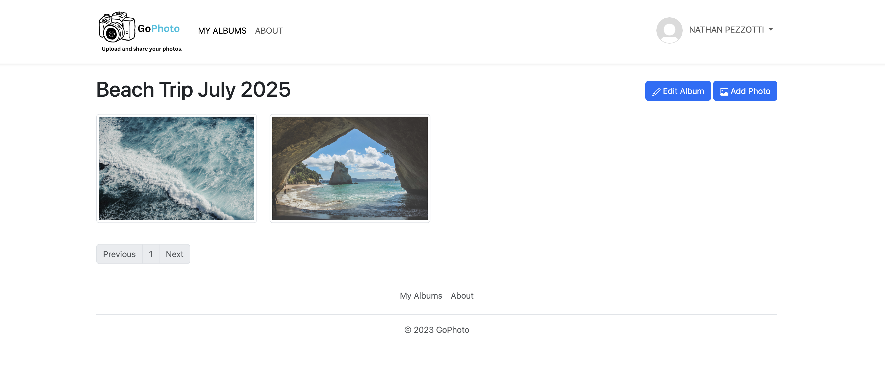

# Go-Photo

A simple photo management application built with Go.

## Features

- Create Albums
- Upload, organize, and browse photos
- Photo storage on local disk or AWS S3
- Secure user authentication and sessions
- Responsive web interface with pagination, toasts, and lightbox for image viewing
- Background worker to prune orphaned images
- Docker Compose development environment
- Kubernetes production deployment

## Demo



## Technologies Used

- Go
- HTML (Go templates), CSS, JavaScript
- PostgreSQL
- AWS S3
- Docker/Docker Compose
- Kubernetes

## Getting Started

**Clone the repository:**
```bash
git clone https://github.com/npezzotti/gophoto.git
cd gophoto
```

**Build and run the Docker Compose application:**
```bash
make run
```

**Open your browser:**
Visit [http://localhost:8080](http://localhost:8080)
