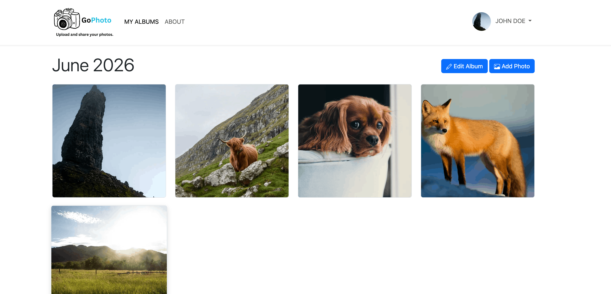

# Go-Photo

Go-Photo is a simple full-stack photo management web application written in Go. Users can register, log in, create albums, upload photos, and browse them in a responsive web UI with pagination and a lightbox viewer. Photos can be stored either on local disk or in AWS S3. A background worker processes uploads (generating variants/thumbnails) and another periodically prunes orphaned images.

## Features

- Create Albums
- Upload, organize, and browse photos
- Photo storage on local disk or AWS S3
- Secure user authentication and sessions
- Responsive web interface with pagination, flash notifications, and a lightbox for image viewing
- Background worker to prune orphaned images
- Docker Compose development environment
- Kubernetes production deployment

## Demo




## Key technologies

| Technology | Role |
|---|---|
| Go 1.20 | Server, routing (`net/http`), HTML templates |
| PostgreSQL | Primary database; also used as session store (`scs/postgresstore`) |
| Redis | Pub/sub queue for dispatching photo processing jobs |
| AWS S3 (SDK v2) | Optional object storage backend |
| bimg / libvips | Image processing — resizing and variant generation |
| sqlc | Type-safe SQL query generation |
| golang-migrate | Database schema migrations |
| nosurf | CSRF protection |
| Docker Compose | Local development environment |
| Kubernetes | Production deployment manifests |

## Project layout

```
cmd/            Entry point (main.go)
internal/
  config/       App configuration (env-based)
  db/           Database layer — sqlc-generated queries + Repository wrapping them
  domain/       Core types: Photo, Album, User, variants, statuses, errors
  service/      Business logic — AlbumService, PhotoService, UserService
  utils/        Path helpers and test utilities
  web/          HTTP handlers, middleware, session/flash, template rendering
  workers/      Background workers (photo processor, storage cleaner)
pkg/
  forms/        Form parsing and validation
  logging/      Structured logger wrapper
  pagination/   Pagination helpers
  store/        Storage abstraction — FileStore (local disk) and S3Store
  template/     Template cache loading
templates/      HTML templates (base layout + pages + partials)
```

## Getting Started

**Clone the repository:**
```bash
git clone https://github.com/npezzotti/gophoto.git
cd gophoto
```

**Build and run the Docker Compose application:**
```bash
make run
```

**Open your browser:**
Visit [http://localhost:8800](http://localhost:8800)
